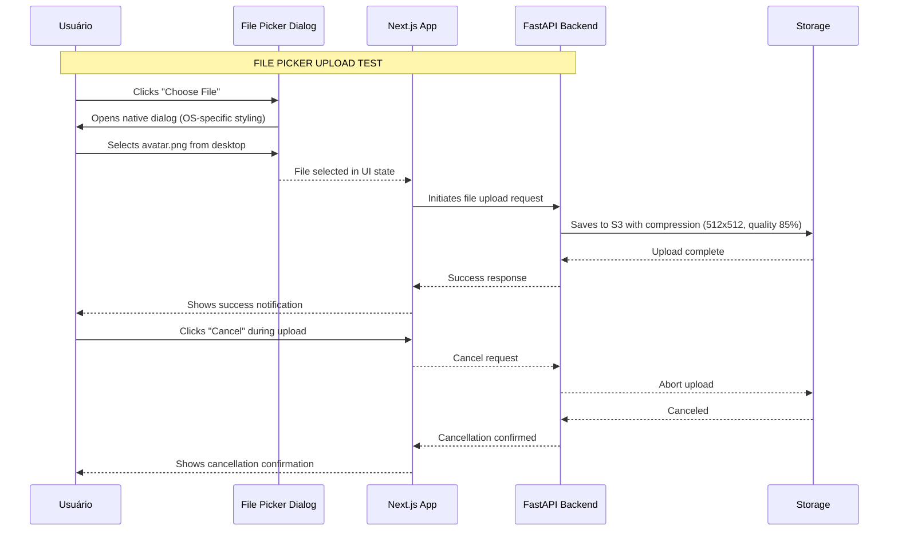

# DTA — Documento Técnico de Aceitação (EXEMPLO GENÉRICO UPLOAD AVATAR)

---

**Versão:** 1.0.0  
**Data:** 2026-06-XX  
**Autor:** Rhuan-P  
**Status:** Aprovado  
**Template Usado:** Template DTA genérico (DTA-template-generico.md)  

---

## 1. Visão Geral da Aceitação

### 1.1 Feature para Validação
Implementar upload de avatar via drag-and-drop + file picker com compressão automática

### 1.2 Objetivo de Validação
Definir critérios objetivos para validar que a implementação atende aos requisitos do DTR e segue os padrões arquiteturais do projeto.

### 1.3 Escopo da Validação
| Inclusivo | Exclusivo |
|-----------|------------|
| Upload via file picker (fallback mobile legacy) | SMS authentication |
| Upload via drag-and-drop (desktop otimizado) | SAML/OIDC flows (for another DTR) |
| Preview + cancelamento em andamento | Social login via other providers (LinkedIn, etc.) |
| Compressão automática (512x512, quality 85%) | Video/image upload |

---

## 2. Critérios de Aceitação (Acceptance Criteria)

### AC-001: File Picker Upload Completa

**Requisito do DTR:** Upload via file picker com fallback universal para mobile legacy  
**Cenário de teste:** Usuário visita página de "Editar Perfil" e clica em "Choose File"

| Step | Expected Behavior | Priority |
|------|-------------------|----------|
| 1. Click on "Choose File" button | Opens native file picker dialog (OS/browser native) | P0 |
| 2. Shows supported formats hint | Dialog shows ".png, .jpg, .webp" below title | P1 |
| 3. User selects avatar.png (524KB) | Returns to page with file selected (ready for upload) | P0 |
| 4. Click "Upload" or auto-submit after 3s delay | Initiates upload progress bar | P0 |

**Acceptance test:** 

