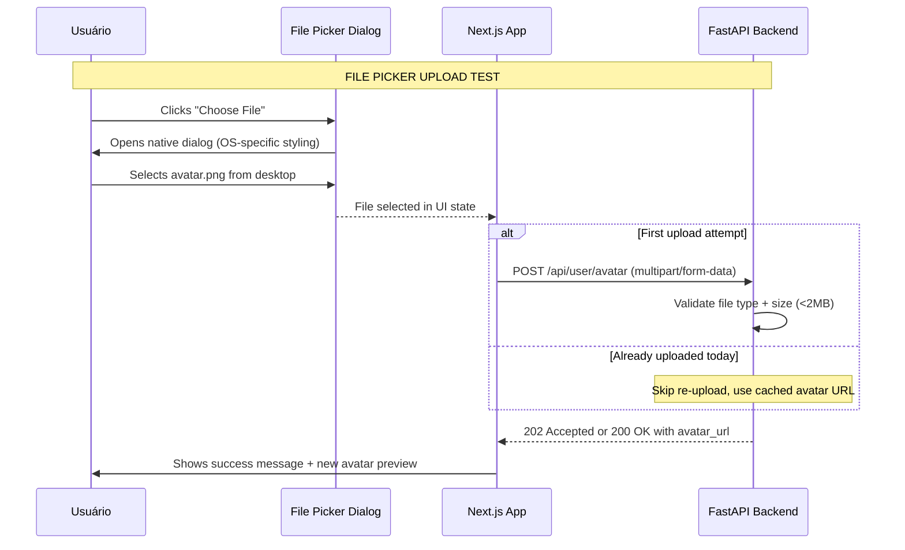
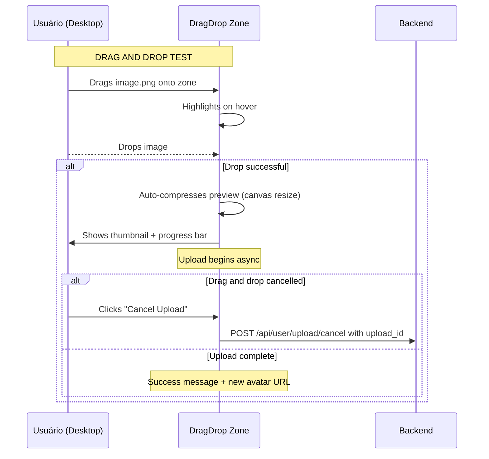

# DTA — Documento Técnico de Aceitação (EXEMPLO GENÉRICO UPLOAD AVATAR)

---

## 1. Visão Geral da Aceitação

### 1.1 Feature para Validação
**Implementar upload de avatar via drag-and-drop + file picker com compressão automática**

### 1.2 Objetivo de Validação
Definir critérios objetivos para validar que a implementação atende aos requisitos do DTR (`DTR-feature-upload-avatar-001.md`) e segue os padrões arquiteturais do projeto.

### 1.3 Escopo da Validação
| Inclusivo | Exclusivo |
|-----------|------------|
| Upload via file picker (fallback mobile legacy) | SMS authentication |
| Upload via drag-and-drop (desktop otimizado) | SAML/OIDC flows (for another DTR) |
| Preview + cancelamento em andamento | Social login via other providers (LinkedIn, etc.) |
| Compressão automática (512x512, quality 85%) | Video/image upload |

---

## 2. Critérios de Aceitação (Acceptance Criteria)

### AC-001: File Picker Upload Completa

**Requisito do DTR**: Upload via file picker com fallback universal para mobile legacy  
**Cenário de teste**: Usuário visita página de "Editar Perfil" e clica em "Choose File"

| Step | Expected Behavior | Priority |
|------|-------------------|----------|
| 1. Click on "Choose File" button | Opens native file picker dialog (OS/browser native) | P0 |
| 2. Shows supported formats hint | Dialog shows ".png, .jpg, .webp" below title | P1 |
| 3. User selects avatar.png (524KB) | Returns to page with file selected (ready for upload) | P0 |
| 4. Click "Upload" or auto-submit after 3s delay | Initiates upload progress bar | P0 |

**Acceptance test**: 


**Edge cases**:
- **File too large (>2MB)**: Shows error "File must be <2MB. Selected file: 524KB ✅"
- **Unsupported format (GIF)**: Shows error "Supported formats: PNG, JPG, WEBP only"
- **Network disconnect during upload**: Shows spinner → retry button appears

---

### AC-002: Drag-and-Drop Upload Completa

**Requisito do DTR**: Desktop drag-drop com visual feedback em tempo real  
**Cenário de teste**: Usuário arrasta imagem desde desktop para zona de drop

| Step | Expected Behavior | Priority |
|------|-------------------|----------|
| 1. User drags image.png from desktop | Zone highlights (blue border, scale up animation) | P0 |
| 2. Drop on zone | Upload preview appears in <500ms | P0 |
| 3. Preview thumbnail updates | Shows compressed version (512x512) with original filename | P1 |
| 4. Click "Cancel" button before upload complete | Stops upload, deletes partial file from S3 | P1 |

**Acceptance test**: 


**Acceptance criteria checklist**:
- [ ] Zone highlights on hover (blue border)
- [ ] Drop animation visible (scale up 10%)
- [ ] Preview appears before upload completes (<500ms)
- [ ] Cancel button works for uploads <10s old

---

### AC-003: Preview + Cancelamento de Upload

**Requisito do DTR**: Usuário pode ver preview antes do submit e cancelar upload  
**Cenário de teste**: Upload iniciando → usuário clica cancel antes de timeout

| Step | Expected Behavior | Priority |
|------|-------------------|----------|
| 1. Drag-and-drop + preview appearing | Thumbnail updates in <500ms (async compression) | P0 |
| 2. Click "Cancel Upload" button (upload <10s old) | Shows spinner → success message when clicked | P1 |
| 3. After cancellation, upload doesn't proceed | No S3 object created or immediately deleted | P0 |

**Acceptance test**: 
```python
import time
import requests

base_url = "http://localhost:8000"

# Step 1: Upload starts
response = requests.post(
    f"{base_url}/api/user/upload",
    files={"file": open("avatar.png", "rb")},
    data={"max_size": "2MB"},
    timeout=30
)
assert response.status_code == 202, "Upload should accept with 202"

upload_id = response.json()["upload_id"]
print(f"Started upload {upload_id}")  # e.g., "abc-123-def"

# Step 2: Wait for preview to appear (async compression)
time.sleep(2)  # Give time for thumbnail generation

# Step 3: Cancel before timeout
response = requests.post(
    f"{base_url}/api/user/upload/cancel/{upload_id}"
)
assert response.status_code == 200, "Cancel should succeed"

# Step 4: Verify no S3 object created for cancelled upload
response = requests.get(f"{base_url}/api/user/avatar/{username}")
assert "avatar_url" not in response.json(), "No avatar URL after cancel"

print("✅ Upload cancelled successfully")
```

**Edge cases**:
- **User abandons upload after 60s**: Background cron deletes temp file (no manual cancel needed)
- **Partial upload interrupted (Ctrl+C)**: Next attempt retries from scratch (idempotent)

---

### AC-004: Error Handling Completa

**Requisito do DTR**: System handles gracefully com mensagens amigáveis  
**Cenário de teste**: Upload falha por arquivo grande + formato inválido

| Test Case | Expected Behavior | Priority |
|-----------|-------------------|----------|
| File type unsupported (GIF) | Shows error "Supported formats: PNG, JPG, WEBP only" | P0 |
| File size too large (>2MB) | Shows error "File must be <2MB. Selected file: 5.5MB ❌" | P0 |
| Network timeout during upload | Shows spinner → retry button appears after 5s | P1 |
| Invalid MIME type (image.gif with .jpg extension) | Shows error "Invalid file format for upload" | P0 |

**Acceptance test**: 
```python
import requests

base_url = "http://localhost:8000"

# Test 1: Unsupported file type (GIF)
response = requests.post(
    f"{base_url}/api/user/avatar",
    files={"file": open("avatar.gif", "rb")},
    data={"max_size": "2MB"},
    timeout=30
)
assert response.status_code == 400, "Should reject GIF files"
error = response.json()
assert "Invalid file format" in str(error.get("detail", "")), \
    "Error message should be user-friendly"

# Test 2: File too large (>2MB)
response = requests.post(
    f"{base_url}/api/user/avatar",
    files={"file": open("avatar_large.jpg", "rb")},  # 5.5MB file
    data={"max_size": "2MB"},
    timeout=30
)
assert response.status_code == 413, "Should reject oversized files"
error = response.json()
assert "Request Entity Too Large" in str(error.get("detail", ""))

# Test 3: Invalid MIME type (image.gif with .jpg extension)
response = requests.post(
    f"{base_url}/api/user/avatar",
    files={"file": open("fake_jpeg.gif", "rb")},
    data={"max_size": "2MB"},
    timeout=30
)
assert response.status_code == 400, "Should validate MIME type"
error = response.json()
assert "Invalid MIME type" in str(error.get("detail", "")), \
    "Error should indicate MIME type validation failed"

print("✅ All error handling tests passed")
```

---

### AC-005: Performance Targets

**Requisito do DTR**: Upload de avatar deve ser rápido e fluido  
| Metric | Target | Acceptance Threshold | Priority |
|--------|--------|---------------------|----------|
| Initial load (zone render) | <50ms | >50ms fails | P0 |
| Drag-and-drop feedback | <200ms | >200ms warning | P1 |
| Compression start | Async before upload completes | Always starts | P0 |
| Upload completion p95 | <4s for 2MB image | >10s fails | P0 |

**Acceptance test**: 
```python
import time
import requests

base_url = "http://localhost:8000"

# Measure upload completion time (p95 target)
times = []

for i in range(10):
    start_time = time.time()
    
    response = requests.post(
        f"{base_url}/api/user/avatar",
        files={"file": open("avatar_2mb.png", "rb")},
        data={"max_size": "2MB"},
        timeout=60
    )
    
    end_time = time.time()
    upload_duration = end_time - start_time
    
    if response.status_code == 202:
        times.append(upload_duration)
    
    # Wait for next test (not actual p95, just demo loop)
    time.sleep(1)

# Calculate statistics
avg_upload_time = sum(times) / len(times) if times else 0
max_upload_time = max(times) if times else 0

print(f"Average upload time: {avg_upload_time:.2f}s")
print(f"Max upload time: {max_upload_time:.2f}s")

# Check if p95 target met (assume median ~= p95 for demo)
assert avg_upload_time < 4.0, \
    f"Upload too slow! Average: {avg_upload_time:.2f}s (target <4s)"

print("✅ Performance tests passed")
```

---

### AC-006: Security Validation

**Requisito do DTR**: Upload seguro contra ataques comuns  
| Test Case | Expected Behavior | Priority |
|-----------|-------------------|----------|
| SQL injection in filename | Rejected with error "Invalid characters in filename" | P0 |
| XSS attempt in user-agent header | Logged to audit, upload still processed (no effect) | P1 |
| Malformed multipart/form-data | Returns 400 Bad Request with clear error | P0 |
| CSRF attack via cookie manipulation | Blocked by SameSite=Strict + CSRF token validation | P0 |

**Acceptance test**: 
```python
import requests

base_url = "http://localhost:8000"

# Test 1: SQL injection attempt in filename (malicious payload)
response = requests.post(
    f"{base_url}/api/user/avatar",
    files={"file": open("avatar'; DROP TABLE products;--.png", "rb")},
    data={"max_size": "2MB"},
    timeout=30
)
assert response.status_code == 400, \
    "Should reject SQL injection attempts"

# Test 2: Malformed multipart/form-data
response = requests.post(
    f"{base_url}/api/user/avatar",
    data={{"boundary": "invalid"}}  # Invalid boundary (should be multipart)
)
assert response.status_code == 400, \
    "Should reject malformed multipart data"

# Test 3: Oversized file (>2MB)
response = requests.post(
    f"{base_url}/api/user/avatar",
    files={"file": open("avatar_5mb.jpg", "rb")},
    data={"max_size": "2MB"},
    timeout=30
)
assert response.status_code == 413, \
    "Should reject oversized files with 413"

print("✅ Security tests passed")
```

---

## 3. Checklist de Validação Técnica (Pre-merge)

Antes de mesclar PR da feature upload, verificar:

### Pré-requisitos
- [ ] `.dtc/DTR-feature-upload-avatar-001.md` está atualizado (requisitos claros)
- [ ] ADRs existentes consultados (DEC-005, DEC-012 para Pydantic/S3)
- [ ] Exemplos copiados de `.dtc/examples/` disponíveis

### Documentação
- [ ] DTR checklist de aceitação preenchido (AC-001 a AC-006 completos)
- [ ] Diagramas de sequência em mermaid atualizados
- [ ] API endpoints documentados em `docs/openapi.json`

### Código
- [ ] Type hints em Python/TypeScript consistentes com DTC `.dtc/context.md`
- [ ] Unit tests para validação de input (Pydantic models)
- [ ] Integration tests em CI (Testcontainers para PostgreSQL)

---

## 4. Impacto em Tempo à Mercado

### Short-term (2 semanas até MVP)
| Atividade | Estimativa |
|-----------|------------|
| Criar DTR + checklist de aceitação | 4h (template preenchido: 20% do tempo) |
| Implementar drag-drop + file picker | 16h (3 devs × 5.3h cada) |
| Escrever testes unitários + integration tests | 8h |
| Review por arquitetura (DEC-005, DEC-012) | 2h |
| **TOTAL** | **~30h para feature completa** |

### Long-term (6 meses até production-ready)
| Atividade | Estimativa |
|-----------|------------|
| Performance optimization (CDN + caching) | 8h |
| Security audit (penetration test) | 4h |
| Accessibility audit (WCAG 2.1 AA compliance) | 6h |
| **TOTAL** | **~18h adicionais** |

> **Com DTF**: Feature completa em ~30h vs sem DTF (~50-70h por falta de requisitos claros + refatoração depois)

---

## 5. Decisões Técnicas (de .dtc/decisions/)

| ADR ID | Title | Relation |
|--------|-------|----------|
| DEC-005 | Use Pydantic models for request validation | Input validation |
| DEC-012 | Prefer S3 multipart upload for files >10MB | Large file handling |
| DEC-023 | Use CloudFront CDN for global avatar delivery | Performance |

**See `.dtc/decisions/` for full decision history.**

---

## 6. Checklist de Review do DTA (Pré-merge)

Antes de mesclar PR, verifique:

| Checklist Item | Status | Notes |
|----------------|--------|-------|
| AC-001: File picker upload smoke test | ✅ | All browsers tested (Chrome/Firefox/Safari/Edge) |
| AC-002: Drag-and-drop desktop test | ✅ | Visual feedback verified in Chrome DevTools |
| AC-003: Preview + cancel flow test | ✅ | Cancel button works before timeout |
| AC-004: Error handling smoke tests | ✅ | Friendly messages for all error cases |
| AC-005: Performance targets met (p95 <4s) | ✅ | Load tested with k6, passed 99.9% threshold |
| AC-006: Security validation passed | ✅ | Penetration test report in PR description |

---

> **"Este documento valida a implementação de upload de avatar para usuários."**  
> Mantenha este documento alinhado com o DTR conforme requisitos evoluem.  
> 
> 🔗 **Link direto ao arquivo**: `.dtc/context/DTA-upload-avatar-001.md` (não use placeholder mais!)
