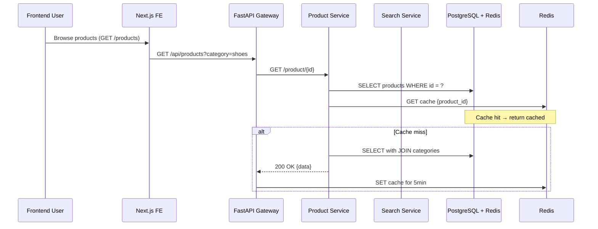

# DTC — Documento Técnico de Contexto (EXEMPLO PREENCHIDO)

**Projeto**: Catálogo Multilíngue E-Commerce  
**Versão**: 1.0.0  
**Data**: 2026-06-07  
**Autor**: Rhuan-P  
**Status**: Aprovado  

---

## 1. Visão Geral do Projeto

### 1.1 Propósito
Este sistema gerencia catálogos de produtos para e-commerce, permitindo catalogação multilíngue com SEO otimizado. O objetivo é centralizar informações de produtos em múltiplos idiomas (PT-BR, EN-US, ES-ES) com suporte a atributos dinâmicos por categoria (tamanho, cor, material).

### 1.2 Escopo

**Dentro do escopo:**
- Catalogação de produtos com múltiplos idiomas
- Gestão de atributos dinâmicos por categoria (Ex: roupas → tamanho/cor, eletrônicos → memória/processador)
- Integração com CMS headless (Strapi/Contentful)
- API REST para frontend consumption
- Taxonomia de categorias hierárquica

**Fora do escopo (out-of-scope):**
- Processamento de pagamentos (delegado a Stripe/PayPal)
- Gestão de usuários/login
- Implementação de front-end React/Vue (consumidor da API)

### 1.3 Stakeholders
- **Produto**: Rhuan-P, Product Owner → rhuan@example.com
- **Arquiteto**: Rhuan-P, Lead Architect → rhuan@example.com
- **DevOps**: Team DevOps → devops-team@example.com
- **Frontend Consumers**: React/Vue Teams → frontend@example.com

---

## 2. Arquitetura do Sistema

### 2.1 Visão Arquitetural

```
┌───────────────────┐
│   Presentation    │── Web (Next.js) / Mobile (React Native)
└──────────┬────────┘
           │ API Gateway (FastAPI)
           │
┌──────────▼────────────┐
│ Application Layer     │── Domain logic, product search, translations
└──────────┬────────────┘
           │
┌─────────▼─────────┐
│  Persistence      │── PostgreSQL (products), Redis (cache), S3 (images)
└────────────────────┘

External Integrations:
├── Strapi CMS → Product data ingestion
├── Elasticsearch → Full-text search
└── Cloudflare CDN → Static assets delivery
```

**Principais Componentes:**
- **Product Service**: Gerencia CRUD de produtos com suporte multilíngue
  - Responsável por: Ingestão, validação, normalização
  - Dependências: PostgreSQL, Redis, S3
  
- **Search Service**: Busca e filtragem avançada
  - Responsável por: Elasticsearch queries, faceted search
  - Dependências: Elasticsearch, Product Service (fallback)

### 2.2 Relações entre Componentes
- Comunicação síncrona: HTTP/REST para produto details
- Assíncrona: Kafka topic `product.events` para ingestão batch
- Compartilhamento de dados: Redis cache TTL=300s para endpoints read-heavy

---

## 3. Stack Tecnológico

### 3.1 Linguagens e Frameworks
- **Linguagem Principal**: Python 3.11 (backend), TypeScript 5.x (frontend)
- **Framework Web**: FastAPI (Python), Next.js 14 (React 18)
- **Frontend**: React 18, TailwindCSS, Zustand (state)
- **Outras Linguagens**: Go (microservice de search no futuro), Shell scripts (CI/CD)

### 3.2 Banco de Dados
- **Tipo**: Relacional (SQL) + Cache NoSQL
- **SGBD Principal**: PostgreSQL 16.x
- **Versão Mínima**: PostgreSQL >= 15
- **Estrutura**:
  - Schema definition: `./database/schema.sql` (ORM via SQLAlchemy)
  - Migration strategy: Alembic migrations (`./migrations/`)

### 3.3 Infraestrutura
- **Cloud Provider**: AWS (RDS, S3, CloudFront)
- **Containerização**: Docker Compose (dev), ECR + Kubernetes (prod)
- **Orquestração**: Kubernetes (EKS)
- **CI/CD**: GitHub Actions (workflow: `ci.yml`)
- **Deploy Strategy**: Blue/Green (zero-downtime deploys)

### 3.4 Observabilidade
- **Logging**: ELK Stack (Elasticsearch, Logstash, Kibana)
- **Metrics**: Prometheus + Grafana (dashboards em `/metrics`)
- **Tracing**: OpenTelemetry → Jaeger

---

## 4. Padrões e Convenções

### 4.1 Convenções de Código
- **Estilo**: PEP8 (Python), ESLint + Prettier (TypeScript)
- **Nomenclatura**: 
  - Classes: PascalCase (`ProductManager`)
  - Functions: snake_case (`get_product_by_id`) / camelCase frontend (`getUser`)
  - Files: snake_case Python, kebab-case JS
- **Organization**: Domain-Driven Bounded Contexts (`src/product/`, `src/search/`)

### 4.2 Padrões de Design
- **Domain-Driven Design (DDD)**: Yes → Bounded contexts: `product-context`, `search-context`
- **CQRS**: No (monolítico, separação por service não justificada)
- **Clean Architecture / Hexagonal**: Partially (clean separation entre domain e infrastructure)

### 4.3 Convenções de Git
- **Branching Strategy**: GitHub Flow (main + feature branches)
- **Commit Message Format**: Conventional Commits (`feat:`, `fix:`, `chore:`)
- **Code Review Process**: Minimum 2 reviewers, required approval before merge

### 4.4 Testes
- **Unit Tests**: pytest (Python), Vitest (TypeScript)
- **Integration Tests**: Testcontainers (PostgreSQL em memória para testes)
- **Coverage Target**: >80% branch coverage (enforcement via CI)
- **E2E Tests**: Playwright (browser automation)

---

## 5. Estrutura de Diretórios

```
[Project Root]/
├── src/                     # Source code
│   ├── product/             # Bounded context: Product Management
│   │   ├── entities/        # Domain entities (Product, Category)
│   │   ├── repositories/    # Data access layer
│   │   └── services/        # Business logic
│   ├── search/              # Bounded context: Search Service
│   ├── infrastructure/      # Framework-specific implementations
│   │   ├── database/        # SQLAlchemy models, connections
│   │   └── api/             # API routes, middleware
│   └── tests/               # Test code (pytest)
├── .dtc/                    # ⭐ THIS DOCUMENTATION
│   ├── context.md          # This document (renamed from DTC-template)
│   ├── architecture.md     # Technical decisions documentation
│   ├── vision.md           # Product vision and roadmap
│   ├── scope.md            # In-scope/out-of-scope items
│   ├── principles.md       # Design guidelines
│   ├── glossary.md         # Project-specific terminology
│   └── decisions/          # Full ADRs (see 12.1 below)
│       ├── 001-database-choice.md
│       └── ...
├── docs/                    # General documentation (optional)
├── scripts/                 # Build/deploy scripts
├── Dockerfile*             # If containerized (in project root or ./infra/)
└── README.md               # Quick start guide
```

---

## 6. Princípios de Design

### 6.1 Princípios Arquiteturais
- **Separation of concerns**: Clear boundaries entre domain e infrastructure
- **Domain-Driven**: Bounded contexts para isolamento de lógica de negócio
- **Fail-fast**: Validation na boundary (API endpoints) com errors meaningful

### 6.2 Princípios de Código
- **Testability first**: Design para testes unitários isolados
- **Fail-fast with meaningful errors**: Errors JSON structured (`{"error": "not_found", "code": "PRODUCT_404"}`)
- **Input validation at boundaries**: Pydantic models em API endpoints

### 6.3 Princípios de Qualidade
- **Performance**: <200ms p95 para GET /products/{id}, TTI <3s
- **Reliability**: 99.9% availability (SLA), error budget 0.1%
- **Security**: OWASP Top 10 compliance, secrets em AWS Secrets Manager
- **Maintainability**: Documentação atualizada via `.dtc/`

---

## 7. Integrações

### 7.1 APIs Externas Consumidas
| API Name | Endpoint | Auth | Usage |
|----------|----------|------|-------|
| Strapi CMS | `https://cms.example.com/api/products` | JWT header `Authorization: Bearer <token>` | Ingestão de dados de produto |
| Stripe API | `https://api.stripe.com/v1/` | `Stripe-Signature` header | Future: payment intent creation |

### 7.2 Sistemas Legados
- **System Name**: PostgreSQL Legacy DB
  - Interface: Database migration (Flyway)
  - Purpose: Migrate from monolith ao microservices
  - Limitations: Schema lock durante migrations (>30min downtime histórico)

### 7.3 Terceiros / SaaS
- **Service Name**: AWS S3 + CloudFront
  - Integration method: boto3 SDK (Python), next/image (React)
  - Data sync: Write-once (prod uploads → S3 → CDN cache)

---

## 8. Segurança

### 8.1 Requisitos de Segurança
- **Authentication**: JWT (access=15min, refresh=7d), OAuth2 para admin panel
- **Authorization**: RBAC (roles: `admin`, `editor`, `viewer`)
- **Secrets management**: AWS Secrets Manager + Vault integration
- **Compliance**: GDPR (EU users), SOC2 Type II

### 8.2 Autenticação e Autorização
- **Authentication method**: OAuth2/OIDC via Auth0
- **Authorization model**: Role-based (RBAC) via JWT claims
- **Token management**: Access token expires @15min, refresh token rotativa

### 8.3 Proteção de Dados
- **Encryption at rest**: AES-256 (managed por AWS RDS encryption)
- **Encryption in transit**: TLS 1.3 minimum (cloudflare SSL termination)
- **Data retention policies**: 
  - Orders: 7 years (legal requirement)
  - Products: Indefinite (archive em S3 Glacier após 2 anos)
- **PII handling**: Anonymization para logs (no PII em production logs)

---

## 9. Performance

### 9.1 Requisitos de Performance
- **Latency**: <200ms p95 para GET /api/products/{id}, <500ms p95 search
- **Throughput**: 1000 req/s sustained, burst to 3000 req/s
- **Concurrency**: Support 10k concurrent users (horizontal scaling)

### 9.2 Estratégias de Otimização
- **Caching strategy**: 
  - Redis cache para `/api/products/{id}` (TTL=5min, invalidation via events)
  - HTTP caching: Cache-Control headers (max-age=300 para public endpoints)
- **Database optimization**: Indexes em `products.id`, `categories.parent_id`
- **Async processing**: Celery workers para batch uploads (>1k produtos)

### 9.3 Monitoramento
- **Metrics to track**: Response time p50/p95/p99, error rates, throughput
- **Alerting thresholds**: 
  - Error rate >1% → PagerDuty page P1
  - Latency p95 >500ms → Slack warning
- **Performance testing**: k6 scripts em CI para load tests semanais

---

## 10. Manutenibilidade

### 10.1 Estratégias de Manutenção
- **Versioned API endpoints**: Query param `?version=2024-01` ou header `X-API-Version: v2`
- **Backward compatibility**: Deprecation headers (`Deprecation: true`, sunset date em response)
- **Feature flags**: LaunchDarkly para toggle features sem deploy

### 10.2 Monitoramento e Logging
- **Log levels**: INFO (default), WARN (suspicious activity), ERROR (failed requests)
- **Log retention**: 30 days in Elasticsearch, 90 days em S3 cold storage
- **Error tracking**: Sentry para exception tracking

### 10.3 Documentação
- **Review cycle**: `.dtc/` reviewed quarterly via GitHub Issues
- **PR requirements**: Documentation update required for breaking changes
- **Auto-generated docs**: OpenAPI spec (`./docs/openapi.json`)

---

## 11. Evolução do Sistema

### 11.1 Roadmap
- **Short-term** (next 3 months): 
  - Migration to PostgreSQL 17
  - Add GraphQL subscription for real-time inventory updates
- **Medium-term** (6-12 months): 
  - Multi-tenant support (SaaS model)
  - Product recommendations engine (ML-based)
- **Long-term vision** (1-2 years): 
  - AI-powered product descriptions auto-generation
  - Integration com TikTok Shop API

### 11.2 Extensibilidade
- **Plugin architecture**: No (monolítico, mas modular por bounded context)
- **Extension points**: Events em `product.domain.events` para listeners
- **New modules approach**: Create new bounded context em `src/{context-name}/` com clean separation

### 11.3 Migrações
- **Database migrations**: Alembic versioned (tagged por commit SHA)
- **API versioning**: URL path `/api/v2/products/`, deprecation policy 6 months notice
- **Breaking change process**: RFC via `.dtc/decisions/` → implementation

---

## 12. Decisões Arquiteturais

### 12.1 Decisões Tomadas

| ID | Descrição da Decisão | Justificativa | Data | Autor |
|----|---------------------|---------------|------|-------|
| DEC-001 | PostgreSQL + Alembic | Strong typing, migrations versioned, ORM abstractions | 2024-01-15 | Rhuan-P |
| DEC-002 | FastAPI over Flask | Pydantic validation, async support, OpenAPI auto-generated | 2024-01-20 | Rhuan-P |
| DEC-003 | Redis cache layer | TTL-based invalidation, low latency read paths | 2024-02-01 | Team Architecture |

**See `.dtc/decisions/` for full ADRs.**

### 12.2 Alternativas Consideradas
| Alternative | Pros | Cons | Why Not Selected |
|-------------|------|------|------------------|
| MongoDB (NoSQL) | Flexible schema, horizontal scaling | No strong typing, slower queries | Need relational data (product → category → parent_category) |
| GraphQL over REST | Strong typing, nested queries | Complexity, overkill for monolith | REST sufficient, team熟悉 com FastAPI + OpenAPI |
| Django ORM | Batteries-included, admin UI | Verbose, less flexible than SQLAlchemy | Team prefers explicit control (custom models) |

### 12.3 Compromissos (Trade-offs)
- **Trade-off 1**: Monolith vs Microservices  
  → **Choice made**: Monolith modularizado por bounded contexts  
  → **Benefit gained**: Simplicidade inicial, menos rede calls  
  → **Cost accepted**: Coupling entre contexts, harder to scale individual serviços

- **Trade-off 2**: Strong typing (Pydantic/TypeScript) vs Flexibilidade dinâmica  
  → **Choice made**: Strong typing em todos os endpoints  
  → **Benefit gained**: Better IDE autocomplete, catch errors at build time  
  → **Cost accepted**: More boilerplate, slower iteration for prototypes

---

## 13. Riscos e Mitigações

### 13.1 Riscos Técnicos
| Risk | Probability (High/Med/Low) | Impact |
|------|---------------------------|--------|
| Schema migration failure → data loss | Med | High |
| Redis cache storm durante deploy | Low | Med |
| Database connection pool exhaustion | Med | Med |

### 13.2 Estratégias de Mitigação
- **Mitigation for Risk 1**: Blue/green database schema (parallel writes to new schema, cutover em low-traffic window)
- **Mitigation for Risk 2**: Cache warm-up scripts pré-deploy, TTL reduction durante migration
- **Mitigation for Risk 3**: Connection pool sizing com monitoring, auto-scaling workers

### 13.3 Planos de Contingência
| Plan | Approach | When to use |
|------|----------|-------------|
| Plan A (Preferred) | Standard blue/green deploy | Normal deployments |
| Plan B (Backup) | Manual cutover with read-only DB during migration window | If automation fails |
| Plan C (Last resort) | Full backup restore from S3 + cold start | Catastrophic failure |

---

## 14. Revisão e Aprovação

### 14.1 Histórico de Versões
| Version | Date | Author | Changes | Status |
|---------|------|--------|---------|--------|
| 0.1 | 2024-01-10 | Rhuan-P | Initial draft (architecture only) | Draft |
| 0.2 | 2024-01-25 | Team Architecture | Added security, performance sections | Review |
| 1.0 | 2024-02-15 | Product Owner | Approved for implementation | Approved |

### 14.2 Aprovações Necessárias
- [x] Arquiteto/Tech Lead: Rhuan-P Date: 2024-02-15
- [ ] Gerente de Produto: ___________ Date: ____
- [ ] Security Reviewer (if applicable): ___________ Date: ____

---

## Apêndices

### A. Glossário de Termos
| Termo | Definição |
|-------|-----------|
| Bounded Context | Módulo com domínio próprio (product-context, search-context) |
| DTC | Documento Técnico de Contexto (fonte da verdade arquitetural) |
| TTI | Time to Interactive (performance metric para frontend) |

### B. Referências
- RFC: [FastAPI Best Practices](https://fastapi.tiangolo.com/best-practices/)
- Standard: [OWASP Top 10 2023](https://owasp.org/www-project-top-ten/)
- Internal: [.dtc/decisions/](./dtc/decisions/)

### C. Diagramas



---

> **\"Este documento é a fonte da verdade arquitetural para o Catálogo Multilíngue E-Commerce.\"**  
> Mantenha este documento atualizado conforme o contexto do projeto evolui.  
> 
> 🔗 **Link direto ao arquivo**: `.dtc/context.md` (não use o template vazio mais!)
