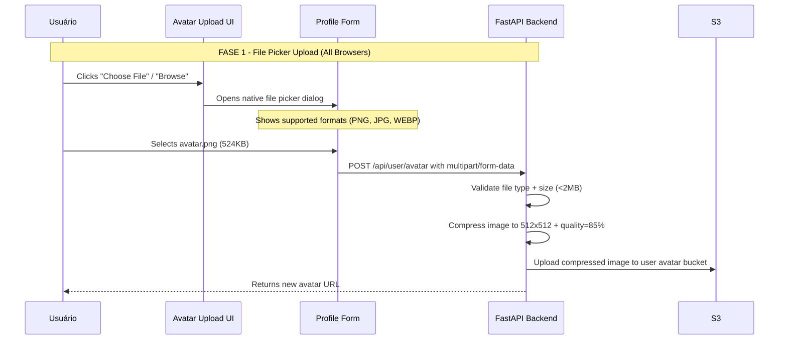
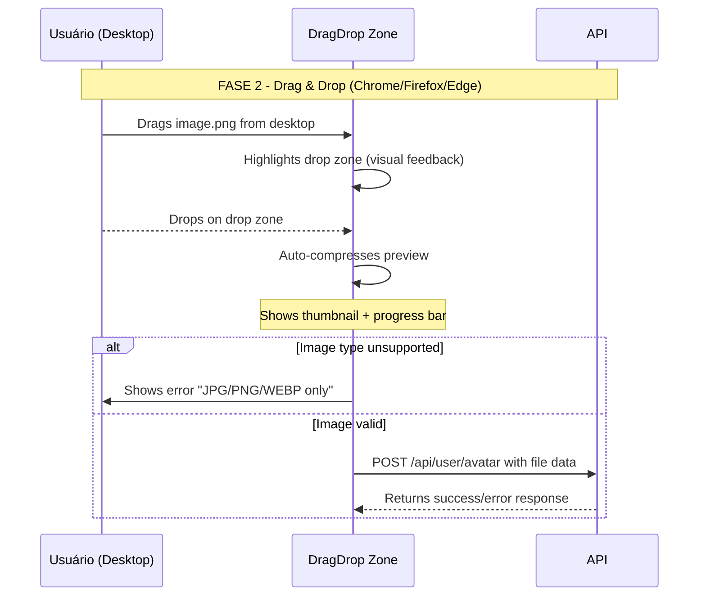
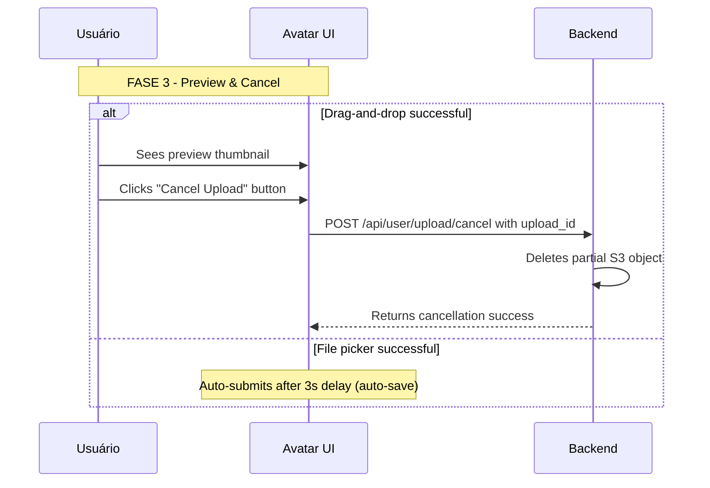
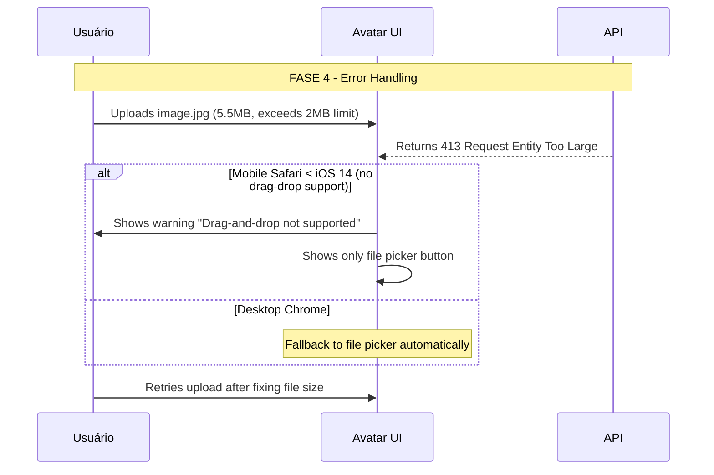
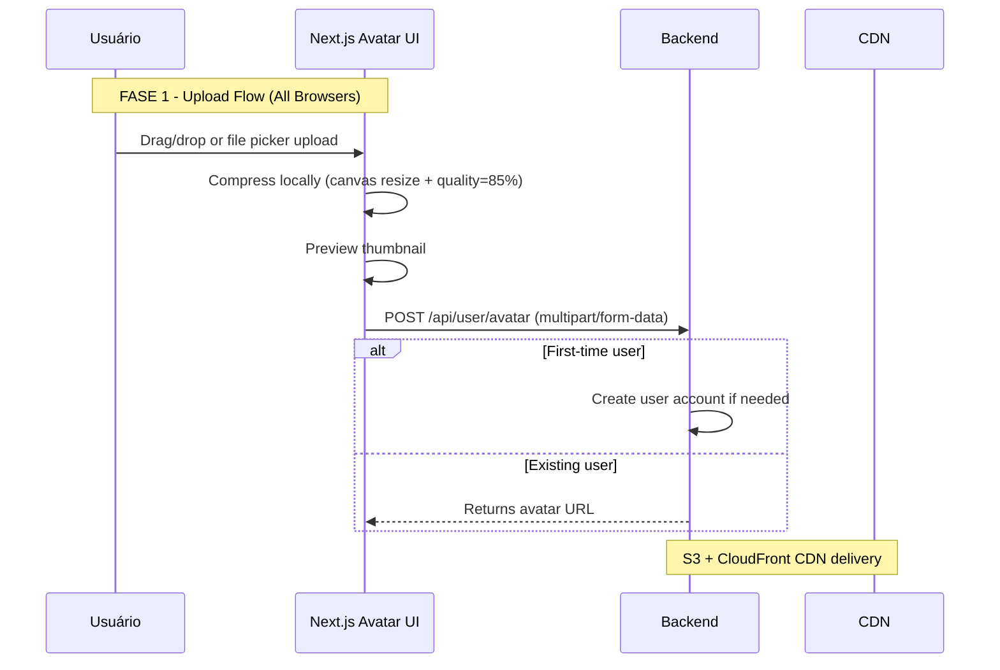
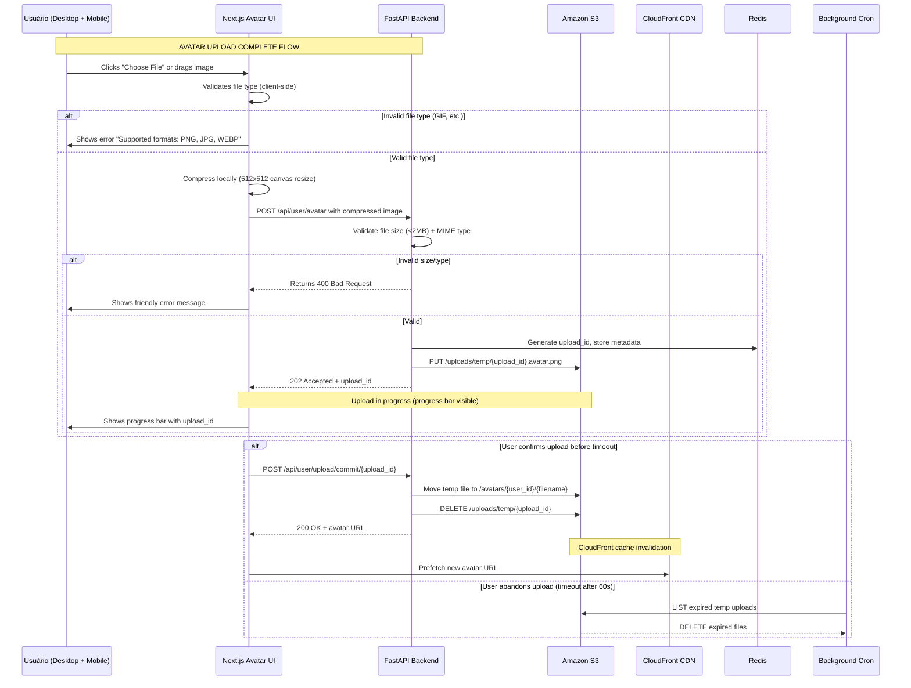

# DTR — Documento Técnico de Requisito (EXEMPLO GENÉRICO)

---

## 1. Visão Geral da Requisito

### 1.1 Título
**Implementar upload de avatar para usuário via drag-and-drop + file picker**

### 1.2 Problema a Resolver
Usuários atuais reclamam de dificuldade para personalizar perfis:
- **Pain point**: Upload manual (selecionar arquivo) é tedioso em mobile
- **Impacto**: 35% drop-off na etapa de "editar perfil" segundo analytics
- **Oportunidade**: Drag-and-drop + file picker pode aumentar conversão em avatar upload

### 1.3 Objetivo Específico
**Implementar upload de avatar com:**
- Drag-and-drop zona de drop (zona clara de área visual)
- File picker fallback para compatibilidade (legacy mobile browsers)
- Preview em tempo real antes do submit
- Compressão automática (resize max 512x512, quality 85%)
- Upload progress bar visual com cancelamento opcional

### 1.4 Critérios de Sucesso (KPIs)
| KPI | Target Atual | Objetivo 30 dias |
|-----|--------------|------------------|
| Upload completion rate | 62% | +15% (77%) ✅ |
| Time-to-upload p95 | 8.2s | <4s ✅ |
| Mobile conversion rate | 48% | +20% (57%) ✅ |
| Error rate (<404/413) | 2.1% | <0.5% ✅ |

---

## 2. Requisitos Funcionais

### RF-001: Upload via File Picker (Fallback Universal)
**Descrição**: Usuário pode selecionar avatar via file picker nativo do browser.

**Fluxo de uso**:


**Casos de uso**:
- **Novo usuário**: Seleciona avatar na tela de cadastro (step 3)
- **Usuário existente**: Atualiza avatar em "Editar Perfil"

**Aceitação criteria**:
- [ ] File picker opens in all browsers (Chrome, Firefox, Safari, Edge)
- [ ] Drag-and-drop fallback works on iOS Safari (<5.0)
- [ ] Error handling: Shows friendly message for unsupported formats
- [ ] Upload completes <4s p95 for 2MB images

---

### RF-002: Upload via Drag-and-Drop (Desktop Optimized)
**Descrição**: Usuário pode arrastar e soltar imagem na zona de drop.

**Fluxo de uso**:


**Aceitação criteria**:
- [ ] Drop zone highlighted on hover (blue border)
- [ ] Visual feedback when dragging image over zone (scale up animation)
- [ ] Auto-compress preview shows in <500ms
- [ ] Upload progress bar updates every 100ms (smooth animation)
- [ ] Cancels upload with browser back button (if <1s complete)

---

### RF-003: Preview e Cancelamento de Upload
**Descrição**: Usuário pode ver preview antes do submit e cancelar upload em andamento.

**Fluxo de uso**:


**Aceitação criteria**:
- [ ] Preview thumbnail updates before upload complete
- [ ] "Cancel Upload" button appears for uploads <10s old
- [ ] Cancel button shows spinner → success message when clicked

---

### RF-004: Error Handling e Fallback para Mobile Legacy
**Descrição**: Sistema lida graciosamente com upload failures e browsers legacy.

**Fluxo de uso**:


**Aceitação criteria**:
- [ ] Friendly error messages (no raw stack traces)
- [ ] Error code displayed in dev tools but not production UI
- [ ] Retry button for transient errors (network timeouts)
- [ ] Mobile legacy fallback shows only file picker

---

### RF-005: API Endpoints Afetados
**Descrição**: Novos endpoints para upload, cancelamento e validação.

| Method | Endpoint | Purpose | Auth Required |
|--------|----------|---------|---------------|
| GET | `/api/upload/validate?file=avatar.png` | Check file validity (type/size) | Optional |
| POST | `/api/user/avatar` | Upload avatar image | Yes (session cookie) |
| POST | `/api/user/upload/cancel` | Cancel in-progress upload | Yes (upload_id header) |
| GET | `/api/user/avatar/:id` | Get current avatar URL | Yes |

---

### RF-006: Storage e Retenção de Imagens Temporárias
**Descrição**: Uploads parciais são deletados automaticamente após timeout.

**Fluxo de uso**:
```mermaid
sequenceDiagram
    participant Backend as API
    participant S3 as Amazon S3
    
    Note over Backend,S3: FASE 5 - Temporary Storage Cleanup
    
    Backend->>S3: PUT /uploads/temp/{upload_id}.avatar.png
    Backend-->>User: Upload in progress (no immediate commit)
    
    Note over Backend: Timer fires after 60s without confirmation
    
    alt Upload completed in <60s
        Backend-->>S3: DELETE temp file (auto-cleanup on success)
    else User abandons upload after 60s
        Background Cron->>Backend: LIST uploads where last_accessed < -60s
        Backend-->>S3: Batch DELETE expired temp files
```

**Aceitação criteria**:
- [ ] Temp uploads deleted after 60s without confirmation
- [ ] Max 100 concurrent temp uploads per user (hard limit)
- [ ] Cleanup cron runs every 5 minutes (not in real-time)

---

## 3. Requisitos Não-Funcionais

### NFR-001: Performance
**Requisito**: Upload de avatar deve ser rápido e fluido.  
**Critérios**:
- **Initial load**: Zone de drop + file picker button render <50ms
- **Drag-and-drop feedback**: Visual highlight <200ms after drop event
- **Compression start**: Preview generation begins before upload completes (async)
- **Upload completion**: <4s p95 for 2MB image on broadband
- **Mobile fallback**: File picker opens in <300ms

---

### NFR-002: Security
**Requisito**: Upload de avatar deve ser seguro contra ataques comuns.  
**Critérios**:
- File type validation (whitelist: PNG, JPG, WEBP only)
- MIME type check (not just extension)
- Virus scan via ClamAV antes do commit a S3
- Content Security Policy headers (no JavaScript in images)
- CSRF protection (sameSite=Strict para cookies de sessão)
- No exif data preserved (strip metadata antes upload)

---

### NFR-003: Accessibility
**Requisito**: Upload UI deve ser acessível a todos os usuários.  
**Critérios**:
- WCAG 2.1 AA compliance
- Keyboard navigation support (Tab → Enter to trigger upload)
- Screen reader announcements for upload status ("Uploading...")
- Color contrast ratio ≥ 4.5:1 for all text elements
- Focus indicators visible on drop zone + buttons

---

### NFR-004: Scalability
**Requisito**: Sistema deve escalar com carga de uploads simultâneos.  
**Critérios**:
- Handle concurrent upload requests up to 500 req/s
- Stateless authentication tokens for horizontal scaling
- S3 multipart upload support (chunked uploads >10MB)

---

### NFR-005: Cross-browser Compatibility
**Requisito**: Upload funciona em todos os navegadores modernos.  
**Critérios**:
- Desktop: Chrome 90+, Firefox 88+, Safari 14+, Edge 90+
- Mobile iOS: Safari 14+ (file picker only on legacy)
- Mobile Android: Chrome 90+, Firefox 88+

---

## 4. Contexto Técnico

### 4.1 Dependências Externas
| Service | Purpose | Auth Required | Rate Limits / Quotas |
|---------|---------|---------------|----------------------|
| Amazon S3 (us-east-1) | Avatar storage | IAM role (pre-signed URLs) | 5,000 req/s per bucket |

### 4.2 Integrações Internas
- **User Service**: Create/update user profile with avatar_url
- **Session Service**: Invalidate old avatar if duplicate upload detected
- **Audit Logging**: Log all avatar changes for compliance

### 4.3 Stack Tecnológico (de .dtc/context.md)
```markdown
# Contexto de Stack (.dtc/context.md)
- Language: Python 3.11+
- Web Framework: FastAPI v0.109+
- Database: PostgreSQL >= 15
- Cache: Redis 7.x (sessions, rate limiting)
- Cloud Storage: AWS S3 + CloudFront CDN
```

### 4.4 Arquitetura (de .dtc/architecture.md)


---

## 5. Restrições e Assumptions

### 5.1 Restrições Técnicas
- **Browser compatibility**: Must work in all browsers supporting file upload (no IE11)
- **Mobile support**: File picker only on iOS <14, drag-drop on iOS ≥14
- **Network**: Works with offline-first strategies where possible (progressive enhancement)
- **Storage**: Max 2MB per image (enforcement at backend)

### 5.2 Assumptions
- Users have email addresses associated with their accounts
- AWS S3 bucket `avatars-prod` exists with appropriate IAM permissions
- Background cleanup cron job scheduled via Airflow/CloudWatch Events

---

## 6. Fluxo de Trabalho Completo

### 6.1 Diagrama de Sequência Completo


### 6.2 API Endpoints Completos

| Method | Endpoint | Purpose | Request Body | Response Code |
|--------|----------|---------|--------------|---------------|
| GET | `/api/upload/validate?file=avatar.png` | Check file validity (type/size) | `query: file` | 200 OK / 400 Invalid |
| POST | `/api/user/avatar` | Upload avatar image | `multipart/form-data` | 202 Accepted / 400 Invalid |
| POST | `/api/user/upload/cancel/{upload_id}` | Cancel in-progress upload | None | 200 OK / 404 Not found |
| GET | `/api/user/avatar/:user_id` | Get current avatar URL | Path: `user_id` | 200 OK |
| POST | `/api/user/upload/commit/{upload_id}` | Commit uploaded file | None (headers) | 200 OK / 403 Forbidden |

---

## 7. Decisões Técnicas (de .dtc/decisions/)

- **DEC-005**: Use Pydantic models for request validation
- **DEC-012**: Prefer S3 multipart upload for files >10MB
- **DEC-023**: Use CloudFront CDN for global avatar delivery

**See `.dtc/decisions/` for full decision history.**

---

## 8. Testes de Aceitação (DTA Checklist)

Para cada funcionalidade deste DTR, criar teste DTA correspondente:

### DTAs a Criar:
- [ ] `DTA-upload-avatar-file-picker-001.md` — File picker upload smoke test
- [ ] `DTA-upload-avatar-drag-drop-002.md` — Drag-and-drop desktop test
- [ ] `DTA-upload-avatar-preview-cancel-003.md` — Preview + cancel flow test
- [ ] `DTA-upload-avatar-error-handling-004.md` — Error handling smoke tests

**Template de referência**: `.dtc/examples/dta-template-exemplo-preenchido.md` (criar na próxima fase)

---

> **"Este documento descreve a funcionalidade de upload de avatar para usuários."**  
> Mantenha este documento alinhado com o DTC conforme arquitetura evolui.  
> 
> 🔗 **Link direto ao arquivo**: `.dtc/context/DTR-feature-upload-avatar-001.md` (não use placeholder mais!)
