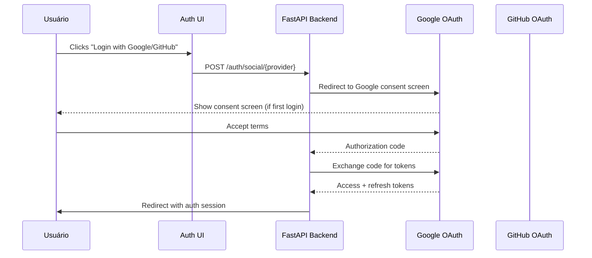

# DTR — Documento Técnico de Requisito

**Projeto**: [Nome do Projeto]  
**Contexto**: [.dtc/context.md](../.dtc/context.md)  
**Versão**: [Versão do Documento]  
**Data**: [Data de Criação]  
**Autor**: [Nome do Autor]  
**Status**: [Rascunho | Em Revisão | Aprovado]

---

## 1. Visão Geral da Requisito

### 1.1 Título
[Ex: "Implementar autenticação OAuth2 com Google e GitHub"]

### 1.2 Problema a Resolver
[Descreva o problema ou funcionalidade que este requisito aborda.]

Exemplo: *"Usuários atuais reclamam de fluxo de login demorado. Precisamos reduzir tempo de autenticação em 80%."*

### 1.3 Objetivo Específico
[Defina claramente o que esta implementação deve alcançar.]

Exemplo: *"Implementar OAuth2 authentication com Google e GitHub providers, permitindo login social em até 5 segundos desde a home page."*

### 1.4 Critérios de Sucesso (KPIs)
[Liste métricas mensuráveis:]
- **Tempo de autenticação**: <5 segundos p95
- **Usuários ativos por mês**: +20% nas primeiras 3 semanas
- **Satisfação do usuário**: NPS >8 para nova feature

---

## 2. Requisitos Funcionais

[Liste os requisitos funcionais específicos:]

### RF-001: Autenticação com Google OAuth2
**Descrição**: Usuário pode se autenticar através do fluxo OAuth2 do Google.  
**Fluxo de uso**: 
1. Usuário clica em "Login com Google"
2. Redireciona para Google consent screen
3. Retorna com authorization code
4. Exchange para access token
5. Cria/associa user account no sistema

**Casos de uso**:
- Novo usuário → Cria conta automaticamente
- Usuário existente (email match) → Associa accounts

**Aceitação criteria**:
- [ ] Redirecionamento correto para Google
- [ ] Consent screen aparece com escopos corretos
- [ ] Token exchange funciona p99 <2s
- [ ] Account association lógica funciona

### RF-002: Autenticação com GitHub OAuth2
**Descrição**: Usuário pode se autenticar através do fluxo OAuth2 do GitHub.  
**Fluxo de uso**: (Similar to Google, ver acima)

**Aceitação criteria**:
- [ ] Same acceptance criteria as Google OAuth2

### RF-003: Single Sign-On Across Sessions
**Descrição**: User session persist after OAuth auth across browser sessions.

**Aceitação criteria**:
- [ ] Session cookie has 7-day expiration
- [ ] Refresh token rotation implemented

### RF-004: Account Linking (Multiple Providers)
**Descrição**: User can link multiple provider accounts to same identity.

**Aceitação criteria**:
- [ ] User profile shows all linked providers
- [ ] Login with any linked provider works
- [ ] UI prevents linking duplicate provider accounts

### RF-005: Error Handling & Fallback
**Descrição**: System gracefully handles OAuth failures and falls back to other providers.

**Aceitação criteria**:
- [ ] Shows friendly error message on auth failure
- [ ] User can retry with different provider
- [ ] Logs all failures for debugging

---

## 3. Requisitos Não-Funcionais

### NFR-001: Performance
**Requisito**: OAuth flows must complete within specified time limits.  
**Critério**: 
- Initial redirect: <50ms
- Consent screen load: <200ms
- Auth completion: <5 seconds p95

### NFR-002: Security
**Requisito**: Implement secure OAuth best practices.  
**Critérios**:
- Use PKCE flow to prevent CSRF attacks
- Store OAuth tokens encrypted at rest
- Set strict cookie HttpOnly, Secure, SameSite attributes
- Validate all authorization codes and tokens

### NFR-003: Availability
**Requisito**: Auth system must be highly available.  
**Critério**: 
- 99.9% uptime for OAuth providers
- Fallback to other providers if one is down

### NFR-004: Scalability
**Requisito**: System must scale with user load.  
**Critério**:
- Handle concurrent auth requests up to 1000 req/s
- Stateless authentication tokens for horizontal scaling

### NFR-005: Accessibility
**Requisito**: Auth UI must be WCAG 2.1 AA compliant.  
**Critérios**:
- Color contrast ratio ≥ 4.5:1
- Keyboard navigation supported
- Screen reader compatible

---

## 4. Contexto Técnico

### 4.1 Dependências Externas
| Service | Purpose | Auth Required | Rate Limits |
|---------|---------|---------------|-------------|
| Google OAuth2 API | Provider auth flow | None (handled by us) | 10k req/day per project |
| GitHub OAuth2 API | Provider auth flow | None (handled by us) | 5k req/hour |

### 4.2 Integrações Internas
- **User Service**: Create/associate user accounts
- **Session Service**: Manage auth sessions
- **Audit Logging**: Log all auth events

### 4.3 Stack Tecnológico (de .dtc/context.md)
[Verifique e cite stack relevante do DTC]

```markdown
# Contexto de Stack (.dtc/context.md)
- Language: Python 3.11+
- Web Framework: FastAPI v0.109+
- Database: PostgreSQL >= 15
- Cache: Redis 7.x (sessions, rate limiting)
- OAuth Library: authlib or python-jose
```

### 4.4 Arquitetura (de .dtc/architecture.md)
[Verifique e cite arquitetura relevante do DTC]

---

## 5. Restrições e Assumptions

### 5.1 Restrições Técnicas
- **Browser compatibility**: Must work in all browsers supporting OAuth2
- **Mobile support**: Auth flows must work on iOS Safari and Android Chrome
- **Network**: Work with offline-first strategies where possible

### 5.2 Assumptions
- Users have email addresses associated with their accounts
- OAuth provider APIs are stable and won't break mid-deployment
- Third-party providers comply with SOC2 Type II security standards

---

## 6. Fluxo de Trabalho Completo

### 6.1 Diagrama de Sequência


### 6.2 API Endpoints Afetados

| Method | Endpoint | Purpose | Auth Required |
|--------|----------|---------|---------------|
| GET | /auth/social/google | Init Google OAuth flow | No (public) |
| GET | /auth/social/github | Init GitHub OAuth flow | No (public) |
| POST | /auth/callback/google | Handle Google callback | Internal |
| POST | /auth/callback/github | Handle GitHub callback | Internal |

### 6.3 Database Schema Changes

```sql
-- Users table additions
ALTER TABLE users ADD COLUMN google_provider_id UUID;
ALTER TABLE users ADD COLUMN github_provider_id UUID;

-- Linking table for multiple providers
CREATE TABLE user_oauth_accounts (
    id UUID PRIMARY KEY DEFAULT gen_random_uuid(),
    user_id UUID REFERENCES users(id) ON DELETE CASCADE,
    provider VARCHAR(50),  -- 'google' or 'github'
    provider_account_id VARCHAR(255),
    access_token_encrypted TEXT,
    refresh_token_encrypted TEXT,
    expires_at TIMESTAMP WITH TIME ZONE,
    created_at TIMESTAMP WITH TIME ZONE DEFAULT NOW(),
    UNIQUE(user_id, provider)
);

-- Audit table for auth events
CREATE TABLE auth_audit_events (
    id UUID PRIMARY KEY DEFAULT gen_random_uuid(),
    event_type VARCHAR(50),  -- 'login', 'logout', 'link_provider'
    user_id UUID REFERENCES users(id),
    ip_address INET,
    user_agent TEXT,
    details JSONB,
    created_at TIMESTAMP WITH TIME ZONE DEFAULT NOW()
);
```

---

## 7. Decisões Técnicas

### 7.1 PKCE Required for All OAuth Flows
**Decisão**: Use PKCE (Proof Key for Code Exchange) para todos os fluxos OAuth2.  
**Rationale**: Prevents authorization code interception attacks, especially in stateless SPAs.  
**Reference**: [OAuth2 spec section 4.1.3](https://datatracker.ietf.org/doc/html/rfc7636#section-4.1.3)

### 7.2 Refresh Token Rotation
**Decisão**: Implement refresh token rotation para security.  
**Rationale**: Mitigates refresh token theft; old tokens invalidated after use.  
**Implementation**: Store original refresh token in audit events, revoke on reuse detection.

### 7.3 Account Linking Strategy
**Decisão**: Permit link accounts with same email address across providers.  
**Rationale**: Improves user experience for users who sign up with different providers over time.  
**Risk**: Be careful of privacy implications if multiple providers represent different identities.

---

## 8. Considerações de Performance

### 8.1 Caching Strategy
[Cache OAuth state to prevent duplicate API calls]

```python
# Cache OAuth authorization URLs for 5 minutes
from flask_caching import Cache

app.config['CACHE_TYPE'] = 'redis'
cache = Cache(app)

@cache.cached(timeout=300, query_string=True)
def get_auth_url(provider: str):
    """Generate and cache auth URL for provider."""
```

### 8.2 Async Processing
[Handle token exchange and user creation asynchronously]

```python
# Use job queue for non-blocking auth completion
from celery import Celery

celery = Celery('auth_tasks', broker='redis://localhost:6379/0')

@celery.task(bind=True, name='tasks.complete_oauth_auth')
def complete_oauth_auth_task(self, oauth_state: dict):
    """Exchange tokens and create user account asynchronously."""
```

---

## 9. Considerações de Segurança

### 9.1 Token Storage
**Requisito**: OAuth access tokens MUST be encrypted at rest.  
**Implementation**: Use AES-256-GCM via cryptography library.

```python
from cryptography.fernet import Fernet
from contextlib import contextmanager

@contextmanager
def encryption_key():
    """Load encryption key from secure location."""
    key_file_path = Path("/secure/tokens.key")  # Not in repo!
    
    try:
        with open(key_file_path, "rb") as f:
            key = f.read()
    except FileNotFoundError:
        raise RuntimeError("OAuth token encryption key not found!")

def encrypt_token(token: str) -> str:
    """Encrypt OAuth access token for storage."""
```

### 9.2 Token Expiration Monitoring
**Requisito**: Monitor and alert on tokens expiring soon.  
**Implementation**: Run hourly cron job to scan tokens expiring within 1 hour.

---

## 10. Plano de Implementação

### 10.1 Phase 1: Core OAuth Integration (Week 1-2)
- [ ] Set up OAuth library (authlib or python-jose)
- [ ] Implement PKCE helper functions
- [ ] Create auth endpoints for Google and GitHub
- [ ] Create callback handlers
- [ ] Write unit tests for auth flow

### 10.2 Phase 2: User Account Management (Week 3)
- [ ] Implement account creation/association logic
- [ ] Handle duplicate account detection
- [ ] Add audit logging
- [ ] Write integration tests with test providers

### 10.3 Phase 3: Security Hardening (Week 4)
- [ ] Implement refresh token rotation
- [ ] Add token encryption layer
- [ ] Configure security headers
- [ ] Penetration testing
- [ ] Write documentation for ops team

---

## 11. Plano de Testes

### 11.1 Unit Tests
| Test Case | Expected Behavior | Priority |
|-----------|-------------------|----------|
| OAuth auth flow happy path | Complete auth with Google/GitHub | P0 |
| PKCE validation | Reject requests without valid PKCE | P0 |
| Account creation on first auth | Create user account automatically | P0 |
| Account linking for existing user | Link to existing account if email matches | P1 |
| Duplicate provider prevention | Prevent same provider link twice | P1 |
| Token expiration handling | Gracefully handle expired tokens | P0 |

### 11.2 Integration Tests
- End-to-end auth flow with mocked OAuth providers
- Database schema changes validated with test migrations
- Redis caching behavior under load

### 11.3 Security Tests
- CSRF prevention (no session fixation)
- Token encryption validated via pen-test tools
- Rate limiting on auth endpoints

---

## 12. Rollout e Monitoramento

### 12.1 Feature Flags
Implement feature flag para gradual rollout:

```python
from flask import request, current_app

def should_enable_social_auth():
    """Enable social auth based on feature flag and rollout schedule."""
    is_feature_enabled = request.headers.get("X-Feature-Social-Auth", "false") == "true"
    
    if not is_feature_enabled:
        # Fall back to traditional login
        return False
    
    # Gradual rollout: start with 10% traffic
    rollout_percent = float(request.headers.get("X-Rollout-Percent", "10")) / 100
    
    return random.random() < rollout_percent
```

### 12.2 Monitoring Events to Track
| Event | Metric Type | Alert Threshold |
|-------|-------------|-----------------|
| `auth.auth_started` | Count | - |
| `auth.auth_success` | Count (p95 time) | >5s |
| `auth.auth_failure` | Count + error rate | >1% failures |
| `auth.oauth.token_exchange_failed` | Error count | Any failures → alert |
| `auth.account_creation_failed` | Error rate | >0.1% |
| `auth.session_not_created` | Error count | Any failures → alert |

### 12.3 Observability Instrumentation
Add structured logging:

```python
from opentelemetry import trace
from opentelemetry.sdk.trace import TracerProvider

tracer = trace.get_tracer(__name__)

with tracer.start_as_current_span("oauth.auth_flow") as span:
    span.set_attribute("auth.provider", provider)
    
    try:
        result = complete_oauth_auth_task.delay(oauth_state)
        span.set_status(TraceStatusStatus.SET_STATUS_OK)
        span.set_attribute("auth.result_id", str(result.id))
        
    except Exception as e:
        span.record_exception(e)
        span.set_status(TraceStatusStatus.SET_STATUS_ERROR)
```

---

## 13. Riscos e Mitigações

| Risco | Probabilidade | Impacto | Mitigação |
|-------|---------------|---------|-----------|
| OAuth provider API changes | Med | High | Monitor provider changelogs, abstract API calls behind interface |
| Token theft via XSS | Low | Critical | HTTPOnly cookies, Content-Security-Policy headers |
| Account linking privacy issues | Med | Medium | Clear UI disclosure, opt-in only for multiple providers |
| Rate limiting by OAuth providers | Med | High | Implement local rate limiting, cache auth URLs |

---

## 14. Checklist de Aceitação

- [ ] Core OAuth integration implemented (Google + GitHub)
- [ ] PKCE flow validated for CSRF protection
- [ ] Refresh token rotation implemented and tested
- [ ] Token encryption at rest verified
- [ ] Audit logging complete with proper context
- [ ] Unit tests >80% coverage for auth module
- [ ] Integration tests pass in staging environment
- [ ] Security review completed (internal pen-test)
- [ ] Documentation updated: API docs, ops runbooks
- [ ] Feature flag implemented for gradual rollout
- [ ] Monitoring dashboards created with alert rules
- [ ] Rollout plan reviewed with security team
- [ ] Production deployment script tested in staging

---

## 15. Aprovações Necessárias

- [ ] Arquiteto/Tech Lead: ___________ Date: ____
- [ ] Security Reviewer: ___________ Date: ____
- [ ] DevOps/Infrastructure Team: ___________ Date: ____
- [ ] Product Owner (validation of business value): ___________ Date: ____

---

## Referências

- [OAuth 2.0 Best Practices](https://github.com/oauth-io/oauth-guide)
- [OpenID Connect Core 1.0](https://openid.net/specs/openid-connect-core-1_0.html)
- [PKCE for OAuth Clients](https://datatracker.ietf.org/doc/html/rfc7636#section-4.1.3)

---

> **"Este DTR especifica o que deve ser implementado para autenticação social com OAuth2."**  
> Referências: [DTC do projeto](../.dtc/context.md), [.dtc/architecture.md](../.dtc/architecture.md)
